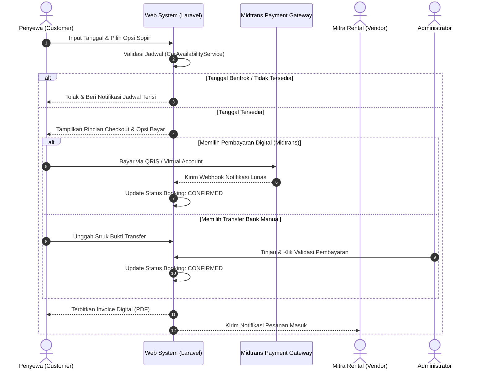
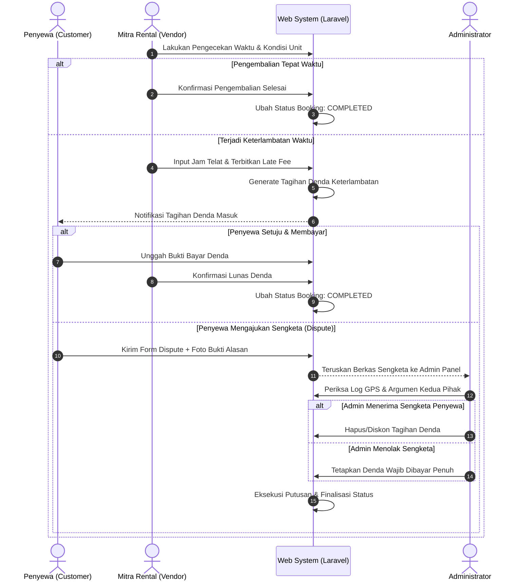

# BUKU PANDUAN PENGGUNAAN DAN DESKRIPSI SISTEM (MANUAL BOOK)
## SISTEM INFORMASI RENTAL MOBIL MULTI-VENDOR BERBASIS WEB

---

**DOKUMEN SPESIFIKASI DAN DESKRIPSI CIPTAAN**  
*Untuk Permohonan Pencatatan Hak Cipta Resmi*  
*Jenis Ciptaan: Program Komputer*  
*Direktorat Jenderal Kekayaan Intelektual (DJKI) — Kementerian Hukum dan Hak Asasi Manusia Republik Indonesia*

---

### LEMBAR IDENTITAS DAN PENGESAHAN CIPTAAN

| Parameter Ciptaan | Keterangan Rinci |
| :--- | :--- |
| **Judul Ciptaan** | **Sistem Informasi Rental Mobil Multi-Vendor Berbasis Web Menggunakan Laravel dan Filament Framework** |
| **Jenis Ciptaan** | Program Komputer (Perangkat Lunak / Software) |
| **Sub-Jenis Ciptaan** | Aplikasi Web Terdistribusi (*Multi-Vendor Web Application*) |
| **Sektor / Bidang Ilmu** | Teknologi Informasi, Rekayasa Perangkat Lunak, *E-Commerce & Smart Transportation* |
| **Bahasa Pemrograman** | PHP (*Hypertext Preprocessor*) v8.2+, JavaScript (ES6+), HTML5, CSS3, SQL |
| **Framework Utama** | Laravel Framework v11.x (MVC Core Engine), Filament PHP v3 (TALL Stack: Tailwind CSS, Alpine.js, Laravel, Livewire) |
| **Sistem Basis Data** | MySQL / MariaDB Relational Database Management System (RDBMS) |
| **Pustaka & API Eksternal** | Midtrans Payment Gateway (Snap API & Webhooks), Leaflet JS & OpenStreetMap Engine, DomPDF Engine, Google Identity OAuth 2.0 |
| **Tahun Pembuatan** | 2026 |
| **Tanggal Pertama Diumumkan** | 2026 |
| **Negara Pertama Diumumkan** | Republik Indonesia |
| **Nama Pencipta 1 (Mahasiswa)**| `[Nama Lengkap Mahasiswa]` (NIM: `[Nomor Induk Mahasiswa]`) |
| **Nama Pencipta 2 (Dosen)**    | `[Nama Lengkap Dosen Pembimbing Beserta Gelar]` (NIDN: `[Nomor Induk Dosen]`) |
| **Institusi Pemegang Hak**     | `[Nama Program Studi / Fakultas / Universitas]` |
| **Alamat Korespondensi**       | `[Alamat Lengkap Perguruan Tinggi / Pemohon]` |

---

## GLOSARIUM DAN DAFTAR ISTILAH TEKNIS

Untuk memudahkan pemahaman terhadap istilah-istilah yang digunakan dalam dokumen ini, berikut adalah definisi operasional istilah teknis sistem:

* **Multi-Vendor Marketplace:** Model arsitektur sistem informasi di mana banyak pemilik usaha rental mobil independen (mitra) dapat bergabung, mengelola armada, dan bertransaksi dengan konsumen dalam satu platform terpusat yang diawasi oleh administrator.
* **Lepas Kunci (*Self-Drive*):** Layanan sewa mobil di mana penyewa mengemudikan kendaraan sendiri tanpa kehadiran pengemudi resmi dari pihak rental.
* **Dengan Supir (*With Driver*):** Layanan sewa mobil yang menyertakan pengemudi resmi terdaftar yang disediakan oleh pihak mitra rental.
* **Smart Availability Engine:** Algoritma kalkulasi ketersediaan armada dan sopir secara *real-time* untuk mencegah terjadinya pemesanan ganda pada rentang waktu yang bertabrakan (*overlap booking*).
* **Date Blocking Calendar:** Fitur kalender interaktif bagi vendor untuk mengunci tanggal-tanggal tertentu agar armada tidak dapat dipesan (misal: perawatan bengkel, servis rutin, atau pemesanan offline).
* **Handover (Serah Terima):** Proses verifikasi kondisi fisik kendaraan, kilometer awal/akhir, dan penyerahan kunci antara pihak rental/sopir dan penyewa.
* **Late Fee Charge:** Tagihan denda finansial otomatis yang diterbitkan kepada penyewa akibat keterlambatan pengembalian unit melewati batas waktu sewa.
* **Dispute Resolution (Sengketa Denda):** Mekanisme peradilan digital di dalam sistem yang memungkinkan penyewa menyanggah denda keterlambatan jika disebabkan oleh kelalaian vendor, dengan keputusan final dimediasi oleh Admin.
* **Car Change Request:** Fitur pengajuan penukaran unit mobil pengganti sebelum masa sewa dimulai (H-1) dengan perhitungan selisih tarif otomatis.
* **Live GPS Tracking & Emergency SOS:** Modul telemetri pemantauan rute kendaraan dan pelaporan darurat insiden di jalan raya secara *real-time*.
* **Lock-in Subscription / Plan:** Skema paket keanggotaan berkala bagi vendor untuk menentukan kuota armada dan akses fitur premium platform.
* **TALL Stack:** Kombinasi arsitektur teknologi modern yang terdiri dari **T**ailwind CSS, **A**lpine.js, **L**aravel, dan **L**ivewire.

---

## DAFTAR ISI

- [BAB I: PENDAHULUAN DAN DESKRIPSI CIPTAAN](#bab-i-pendahuluan-dan-deskripsi-ciptaan)
  - [1.1 Latar Belakang & Permasalahan Industri](#11-latar-belakang--permasalahan-industri)
  - [1.2 Tujuan & Sasaran Sistem](#12-tujuan--sasaran-sistem)
  - [1.3 Nilai Kebaruan (*Novelty*) & Keunggulan Inovasi](#13-nilai-kebaruan-novelty--keunggulan-inovasi)
- [BAB II: ARSITEKTUR DAN SPESIFIKASI TEKNOLOGI](#bab-ii-arsitektur-dan-spesifikasi-teknologi)
  - [2.1 Spesifikasi Kebutuhan Perangkat Keras (*Hardware*)](#21-spesifikasi-kebutuhan-perangkat-keras-hardware)
  - [2.2 Spesifikasi Kebutuhan Perangkat Lunak (*Software Stack*)](#22-spesifikasi-kebutuhan-perangkat-lunak-software-stack)
  - [2.3 Arsitektur Perangkat Lunak Multi-Layer](#23-arsitektur-perangkat-lunak-multi-layer)
  - [2.4 Integrasi Layanan Pihak Ketiga (*APIs & External Services*)](#24-integrasi-layanan-pihak-ketiga-apis--external-services)
- [BAB III: STRUKTUR DATA DAN PERANCANGAN ENTITAS BASIS DATA](#bab-iii-struktur-data-dan-perancangan-entitas-basis-data)
  - [3.1 Diagram Hubungan Entitas (*Entity Relationship Structure*)](#31-diagram-hubungan-entitas-entity-relationship-structure)
  - [3.2 Kamus Data Entitas Utama (*Data Dictionary*)](#32-kamus-data-entitas-utama-data-dictionary)
- [BAB IV: STRUKTUR PENGGUNA DAN DIAGRAM ALUR BISNIS](#bab-iv-struktur-pengguna-dan-diagram-alur-bisnis)
  - [4.1 Matriks Peran dan Hak Akses (*Role Access Matrix*)](#41-matriks-peran-dan-hak-akses-role-access-matrix)
  - [4.2 Use Case Diagram Sistem](#42-use-case-diagram-sistem)
  - [4.3 Sequence & Activity Diagram Alur Transaksi Kritis](#43-sequence--activity-diagram-alur-transaksi-kritis)
- [BAB V: PANDUAN PENGOPERASIAN SISTEM SECARA MENYELURUH (USER MANUAL)](#bab-v-panduan-pengoperasian-sistem-secara-menyeluruh-user-manual)
  - [5.1 Modul 1: Antarmuka Publik dan Penyewa (*Customer Portal*)](#51-modul-1-antarmuka-publik-dan-penyewa-customer-portal)
  - [5.2 Modul 2: Panel Manajemen Mitra (*Vendor Filament Panel*)](#52-modul-2-panel-manajemen-mitra-vendor-filament-panel)
  - [5.3 Modul 3: Panel Pengawas Utama (*Administrator Filament Panel*)](#53-modul-3-panel-pengawas-utama-administrator-filament-panel)
  - [5.4 Modul 4: Portal Lapangan Cepat Sopir (*Driver Mobile Quick Portal*)](#54-modul-4-portal-lapangan-cepat-sopir-driver-mobile-quick-portal)
- [BAB VI: PENGUJIAN DAN KEAMANAN SISTEM PERANGKAT LUNAK](#bab-vi-pengujian-dan-keamanan-sistem-perangkat-lunak)
  - [6.1 Matriks Pengujian Sistem (*Black-Box Testing Cases*)](#61-matriks-pengujian-sistem-black-box-testing-cases)
  - [6.2 Aspek Keamanan, Kriptografi, dan Kepatuhan Privasi Data](#62-aspek-keamanan-kriptografi-dan-kepatuhan-privasi-data)
- [BAB VII: PENUTUP DAN PERNYATAAN KLAIM HAK CIPTA](#bab-vii-penutup-dan-pernyataan-klaim-hak-cipta)

---

## BAB I: PENDAHULUAN DAN DESKRIPSI CIPTAAN

### 1.1 Latar Belakang & Permasalahan Industri
Industri jasa transportasi sewa kendaraan (rental mobil) memegang peranan krusial dalam mendukung mobilitas pariwisata, kegiatan bisnis, dan logistik masyarakat Indonesia. Kendati demikian, sebagian besar pelaku usaha rental skala mikro, kecil, dan menengah (UMKM) masih mengoperasikan bisnisnya secara manual dan konvensional. Pendataan armada yang bergantung pada buku catatan fisik atau pesan instan WhatsApp kerap memicu permasalahan fatal, seperti:
1. **Pemesanan Ganda (*Double Booking*):** Terjadinya benturan jadwal sewa unit mobil yang sama pada tanggal yang beririsan akibat lemahnya sinkronisasi ketersediaan armada.
2. **Ketidakpastian Ketersediaan Sopir:** Sulitnya memetakan jadwal supir yang sedang bertugas di luar kota dengan jadwal pemesanan pelanggan baru.
3. **Ketidaktransparanan Biaya Denda & Sengketa Kerusakan:** Tidak adanya standardisasi perhitungan denda keterlambatan dan saluran mediasi yang adil saat terjadi insiden di lapangan.
4. **Resiko Keamanan & Kehilangan Armada:** Ketiadaan integrasi sistem pelacak posisi kendaraan langsung (*real-time GPS*) dan jalur pelaporan darurat saat pengemudi/penyewa mengalami kendala fatal di perjalanan.
5. **Keterbatasan Akses Pasar Vendor Lokal:** Sulitnya vendor lokal bersaing secara digital karena tingginya biaya investasi pembuatan infrastruktur aplikasi mandiri.

Berangkat dari persoalan tersebut, dirancang dan diimplementasikan karya cipta perangkat lunak **"Sistem Informasi Rental Mobil Multi-Vendor Berbasis Web"**. Sistem ini hadir sebagai solusi ekosistem terpadu (*all-in-one marketplace solution*) yang menjembatani banyak mitra rental lokal, penyewa, pengemudi, dan pengawas platform dalam satu arsitektur perangkat lunak yang aman, terotomatisasi, dan transparan.

### 1.2 Tujuan & Sasaran Sistem
Tujuan utama dari perancangan ciptaan program komputer ini adalah:
* Membangun platform multi-penjual (*multi-vendor*) yang memungkinkan pemilik rental mobil mendaftarkan usaha, memvalidasi legalitas, mengelola armada, menetapkan paket harga, dan memantau pembukuan secara mandiri.
* Mengotomatisasi validasi ketersediaan armada dan penugasan sopir berbasis mesin kalkulasi waktu (*time-window validation*) guna meniadakan *human-error* jadwal.
* Menyediakan sistem gerbang pembayaran digital multi-kanal (otomatis melalui Midtrans dan transfer bank manual) yang terhubung langsung dengan penerbitan invoice digital resmi.
* Mengembangkan modul perlindungan transaksi melalui alur *Handover Check-in/Check-out*, pelaporan keterlambatan, penanganan denda, dan mekanisme *Dispute Resolution* yang dimediasi oleh Administrator.
* Mengintegrasikan telemetri perjalanan (*Live Tracking Leaflet OpenStreetMap*) dan sistem tanggap darurat (*Emergency SOS Dispatch*).

### 1.3 Nilai Kebaruan (*Novelty*) & Keunggulan Inovasi
Karya cipta ini memiliki serangkaian kebaruan fungsional dan teknis yang membedakannya dari sistem sewa kendaraan yang telah ada sebelumnya:
1. **Multi-Guard Independent Authentication Architecture:** Sistem memisahkan secara modular sesi login antara penyewa publik (Web Guard), mitra usaha (Vendor Guard Filament), dan pengawas sistem (Admin Guard Filament) untuk menjamin isolasi hak akses data.
2. **Algoritma Dynamic Availability & Driver Scheduling Engine:** Mesin validasi pintar yang memverifikasi benturan jadwal mobil sekaligus jadwal supir secara simultan sebelum transaksi dibayarkan.
3. **Fitur Tukar Armada Pra-Sewa (*Car Change Request*):** Memberikan fleksibilitas bagi konsumen untuk mengganti tipe unit mobil maksimal sebelum H-1 masa sewa dengan rekonsiliasi selisih dana otomatis.
4. **Sistem Sengketa Denda Berkeadilan (*Late-Fee Dispute System*):** Apabila timbul denda keterlambatan yang disebabkan oleh faktor eksternal atau kesalahan armada vendor, konsumen berhak mengajukan sanggahan formal disertai bukti foto/kronologi yang diadili secara netral oleh Superadmin.
5. **Portal Cepat Sopir Nir-Instalasi (*Driver Quick Mobile Web*):** Antarmuka berbasis tautan terenkripsi aman yang dapat diakses pengemudi dari peramban ponsel pintar tanpa mewajibkan unduhan aplikasi berat dari Play Store/App Store.
6. **Ekosistem Billing & Subscription Vendor (Tiering Plan):** Mekanisme paket langganan berjenjang yang membatasi kuota unggah unit mobil vendor berdasarkan status aktif langganan.

---

## BAB II: ARSITEKTUR DAN SPESIFIKASI TEKNOLOGI

### 2.1 Spesifikasi Kebutuhan Perangkat Keras (*Hardware*)

#### A. Lingkungan Server Produksi / Cloud Hosting
* **Unit Pemroses (Processor):** Minimal 2 Core vCPU 2.4 GHz (Disarankan 4 Core vCPU untuk skalabilitas konkurensi tinggi).
* **Memori Utama (RAM):** Minimal 2.0 GB RAM (Disarankan 4.0 GB ke atas).
* **Media Penyimpanan (Disk Storage):** Minimal 20 GB Solid State Drive (SSD) / NVMe dengan alokasi khusus penyimpanan dokumen terenkripsi.
* **Konektivitas Jaringan:** Bandwidth internet simetris minimal 100 Mbps dengan alamat IP Statis Publik dan sertifikat keamanan SSL/TLS (HTTPS).

#### B. Lingkungan Perangkat Klien (Pengguna Akhir)
* **Perangkat Pengguna:** Laptop, Personal Computer (PC), Komputer Tablet, atau Ponsel Cerdas (Android / iOS).
* **Resolusi Layar Minimal:** 360 x 640 piksel (Mobile Viewport) hingga 1920 x 1080 piksel (Desktop High Definition).

### 2.2 Spesifikasi Kebutuhan Perangkat Lunak (*Software Stack*)

```
+-------------------------------------------------------------------------------+
|                       KOMPOSISI TEKNOLOGI PERANGKAT LUNAK                     |
+----------------------+--------------------------------------------------------+
| Komponen             | Spesifikasi / Teknologi yang Digunakan                 |
+----------------------+--------------------------------------------------------+
| Sistem Operasi Server| Ubuntu Linux 22.04 LTS / Windows Server (XAMPP/Laragon)|
| Bahasa Pemrograman   | PHP (Hypertext Preprocessor) versi 8.2.x atau 8.3.x    |
| Web Server Engine    | Nginx v1.24+ / Apache HTTP Server v2.4+                |
| Framework Backend    | Laravel Framework versi 11.x (Service-Driven MVC)      |
| Admin/Vendor Panel   | Filament PHP Framework versi 3.x (TALL Stack)          |
| Sistem Basis Data    | MySQL Database Engine versi 8.0+ / MariaDB 10.4+       |
| Kompiler Frontend    | Node.js LTS Engine v20.x & Vite v5.x Asset Bundler     |
| Pustaka Reaktif & UI | Tailwind CSS v3.x, Alpine.js v3.x, Livewire v3.x       |
| Pustaka Pemetaan     | Leaflet.js v1.9+ & OpenStreetMap Tile Server           |
| Format Pertukaran    | JSON (JavaScript Object Notation) RESTful Format       |
+----------------------+--------------------------------------------------------+
```

### 2.3 Arsitektur Perangkat Lunak Multi-Layer
Sistem dibangun mengacu pada pola arsitektur **Model-View-Controller (MVC)** yang diperkaya dengan **Service Layer Pattern** untuk menjaga kerapian kode, modularitas, dan memudahkan pemeliharaan jangka panjang:

```
+-----------------------------------------------------------------------------------+
|                            PRESENTATION & VIEW LAYER                              |
|   - Blade View Templates (Customer Interface)     - Livewire Components (Reactive)|
|   - Filament Resource Pages (Vendor & Admin)      - Mobile Driver Portal Web View |
+-----------------------------------------+-----------------------------------------+
                                          |
                                          v
+-----------------------------------------------------------------------------------+
|                        ROUTING, GUARDS & SECURITY MIDDLEWARE                      |
|   - Multi-Guard Auth (web, vendor, admin)         - CSRF Protection Layer         |
|   - Throttle Rate Limiter (Anti-Brute Force)      - Encrypted Signature Middleware|
+-----------------------------------------+-----------------------------------------+
                                          |
                                          v
+-----------------------------------------------------------------------------------+
|                       CONTROLLERS & RESTFUL API HANDLERS                          |
|   - BookingController        - PaymentController       - LiveTrackingController   |
|   - LateFeeController        - CarChangeController     - EmergencyController      |
+-----------------------------------------+-----------------------------------------+
                                          |
                                          v
+-----------------------------------------------------------------------------------+
|                     SERVICE LAYER (CORE BUSINESS LOGIC ENGINE)                    |
|   - CarAvailabilityService   - LateReturnService       - MidtransPaymentService   |
|   - DriverAssignmentService  - SubscriptionService     - PayoutCalculationService |
+-----------------------------------------+-----------------------------------------+
                                          |
                                          v
+-----------------------------------------------------------------------------------+
|                     DATA ACCESS LAYER (ELOQUENT ORM & REPOSITORY)                 |
|   - Model Relationships (Polymorphic, HasMany, BelongsTo)  - Database Query Scopes|
+-----------------------------------------+-----------------------------------------+
                                          |
                                          v
+-----------------------------------------------------------------------------------+
|                       PERSISTENCE LAYER (MySQL / MariaDB RDBMS)                   |
+-----------------------------------------------------------------------------------+
```

### 2.4 Integrasi Layanan Pihak Ketiga (*APIs & External Services*)
1. **Midtrans Snap API & Webhook:** Menyediakan pemrosesan pembayaran otomatis multi-saluran (QRIS, Virtual Account BCA/BNI/BRI/Mandiri, E-Wallet GoPay/ShopeePay). Notifikasi pelunasan ditangkap secara nir-sinkron (*asynchronous webhook*) dengan validasi tanda tangan SHA-512.
2. **Google Identity Platform (OAuth 2.0):** Memberikan kenyamanan pendaftaran dan autentikasi instan bagi penyewa melalui kredensial Google Account.
3. **OpenStreetMap & Leaflet Geolocation Engine:** Menghasilkan pemetaan rute perjalanan kendaraan, kalkulasi titik koordinat lintang (*latitude*) dan bujur (*longitude*), serta radius darurat.
4. **DomPDF Engine & Laravel Excel Maatwebsite:** Menghasilkan berkas cetak digital resmi berupa Invoice Penyewaan, Lembar Serah Terima Kendaraan, Kuitansi Denda, dan Rekapitulasi Laporan Finansial.

---

## BAB III: STRUKTUR DATA DAN PERANCANGAN ENTITAS BASIS DATA

### 3.1 Diagram Hubungan Entitas (*Entity Relationship Structure*)
Sistem mengelola relasi basis data relasional kompleks yang mencakup 46 tabel terintegrasi dengan integritas referensial *Foreign Key Constraint*:

```
  +------------------+         +------------------+         +------------------+
  |      USERS       | 1     1 |     CUSTOMERS    | 1     N |     BOOKINGS     |
  |------------------|---------|------------------|---------|------------------|
  | id (PK)          |         | id (PK)          |         | id (PK)          |
  | email            |         | user_id (FK)     |         | code (Unique)    |
  | password         |         | phone, ktp_no    |         | customer_id (FK) |
  | role             |         | driver_license   |         | car_id (FK)      |
  +------------------+         +------------------+         | driver_id (FK)   |
           | 1                                              | start_date, end  |
           |                                                | grand_total      |
           | 1                                              | status           |
  +------------------+                                      +------------------+
  |     VENDORS      | 1     N +------------------+                  | 1
  |------------------|---------|       CARS       | 1                |
  | id (PK)          |         |------------------|                  |
  | user_id (FK)     |         | id (PK)          |                  | 1..N
  | company_name     |         | vendor_id (FK)   |         +------------------+
  | nib_number       |         | brand, model     |         |     PAYMENTS     |
  | is_verified      |         | license_plate    |         |------------------|
  +------------------+         | price_per_day    |         | id (PK)          |
           | 1                 | is_active        |         | booking_id (FK)  |
           |                   +------------------+         | payment_method   |
           | 1..N                                           | amount, status   |
  +------------------+                                      +------------------+
  |     DRIVERS      |                                               | 1
  |------------------|                                               |
  | id (PK)          |                                               | 1..N
  | vendor_id (FK)   |                                      +--------------------+
  | name, phone      |                                      |  LATE_FEE_CHARGES  |
  | sim_number       |                                      |--------------------|
  | is_active        |                                      | id (PK)            |
  +------------------+                                      | booking_id (FK)    |
                                                            | hours_delayed      |
                                                            | total_charge       |
                                                            | dispute_status     |
                                                            +--------------------+
```

### 3.2 Kamus Data Entitas Utama (*Data Dictionary*)

#### 1. Entitas Tabel `users`
Menyimpan identitas dasar seluruh pengguna sistem lintas peran.
* `id` (BigInt, PK, Auto Increment): ID unik pengguna.
* `name` (Varchar 255): Nama lengkap pengguna.
* `email` (Varchar 255, Unique): Alamat surel aktif untuk login dan notifikasi.
* `password` (Varchar 255): Kata sandi terenkripsi algoritma Bcrypt.
* `role` (Enum: 'admin', 'vendor', 'customer'): Penentu tingkat wewenang.
* `email_verified_at` (Timestamp, Nullable): Waktu validasi email.

#### 2. Entitas Tabel `vendors`
Menyimpan profil badan usaha mitra rental mobil.
* `id` (BigInt, PK, Auto Increment): ID unik mitra.
* `user_id` (BigInt, FK): Referensi relasi ke tabel `users`.
* `company_name` (Varchar 255): Nama resmi usaha rental.
* `nib_number` (Varchar 100, Nullable): Nomor Izin Berusaha / NPWP.
* `address` (Text): Alamat lengkap lokasi kantor/garasi.
* `bank_name`, `bank_account_number`, `bank_account_holder` (Varchar): Data rekening pencairan.
* `status` (Enum: 'pending', 'approved', 'rejected', 'suspended'): Status verifikasi legalitas.

#### 3. Entitas Tabel `cars`
Menyimpan katalog spesifikasi dan tarif armada rental.
* `id` (BigInt, PK, Auto Increment): ID unit mobil.
* `vendor_id` (BigInt, FK): Pemilik armada kendaraan.
* `brand_id`, `model_id`, `category_id` (BigInt, FK): Klasifikasi kendaraan.
* `license_plate` (Varchar 20, Unique): Nomor plat polisi kendaraan.
* `transmission` (Enum: 'manual', 'automatic'): Jenis transmisi mobil.
* `fuel_type` (Enum: 'bensin', 'diesel', 'hybrid', 'electric'): Jenis bahan bakar.
* `seat_capacity` (Integer): Jumlah kursi penumpang.
* `price_per_day` (Decimal 12,2): Tarif dasar sewa harian (lepas kunci).
* `driver_fee_per_day` (Decimal 12,2): Biaya tambahan layanan supir harian.
* `status` (Enum: 'active', 'maintenance', 'inactive'): Status operasional unit.

#### 4. Entitas Tabel `bookings`
Menyimpan seluruh transaksi penyewaan kendaraan.
* `id` (BigInt, PK, Auto Increment): ID transaksi.
* `code` (Varchar 50, Unique): Kode unik booking (contoh: `BK-202608-0012`).
* `customer_id` (BigInt, FK): Penyewa yang melakukan transaksi.
* `car_id` (BigInt, FK): Unit mobil yang disewa.
* `driver_id` (BigInt, FK, Nullable): Sopir yang ditugaskan (jika opsi supir dipilih).
* `with_driver` (Boolean): Penanda sewa lepas kunci (false) atau dengan supir (true).
* `start_date`, `end_date` (DateTime): Periode masa sewa kendaraan.
* `pickup_location`, `dropoff_location` (Text): Titik jemput dan serah terima.
* `total_days` (Integer): Total durasi hari sewa.
* `car_price_total`, `driver_fee_total`, `grand_total` (Decimal 12,2): Rincian kalkulasi biaya.
* `status` (Enum: 'pending', 'confirmed', 'ongoing', 'completed', 'cancelled', 'rejected'): Status siklus pesanan.

#### 5. Entitas Tabel `late_fee_charges`
Mencatat tagihan denda dan alur sengketa keterlambatan pengembalian mobil.
* `id` (BigInt, PK, Auto Increment): ID tagihan denda.
* `booking_id` (BigInt, FK): Referensi pesanan terkait.
* `hours_delayed` (Integer): Jumlah durasi jam keterlambatan.
* `hourly_rate` (Decimal 12,2): Nilai tarif denda per jam.
* `total_charge` (Decimal 12,2): Total denda yang harus dibayar penyewa.
* `payment_status` (Enum: 'unpaid', 'paid', 'waived'): Status pelunasan denda.
* `dispute_status` (Enum: 'none', 'pending', 'approved', 'rejected'): Status sanggahan penyewa.
* `dispute_reason` (Text, Nullable): Alasan keberatan yang diajukan pelanggan.
* `dispute_proof_path` (Varchar, Nullable): Berkas foto bukti sanggahan.
* `admin_resolution_notes` (Text, Nullable): Pertimbangan keputusan putusan Admin.

#### 6. Entitas Tabel `emergency_reports`
Menyimpan data laporan insiden darurat di jalan raya.
* `id` (BigInt, PK, Auto Increment): ID laporan darurat.
* `booking_id` (BigInt, FK): Pesanan yang mengalami insiden.
* `latitude`, `longitude` (Decimal 10,8): Titik koordinat GPS saat tombol SOS ditekan.
* `emergency_type` (Enum: 'accident', 'breakdown', 'security_threat', 'medical'): Jenis situasi darurat.
* `description` (Text): Rincian kejadian di lokasi.
* `status` (Enum: 'reported', 'in_progress', 'resolved'): Status penanganan dari posko.

---

## BAB IV: STRUKTUR PENGGUNA DAN DIAGRAM ALUR BISNIS

### 4.1 Matriks Peran dan Hak Akses (*Role Access Matrix*)

| Modul & Fungsionalitas Sistem | Pelanggan (Customer) | Mitra Rental (Vendor) | Super Administrator | Pengemudi (Driver) |
| :--- | :---: | :---: | :---: | :---: |
| Registrasi & Manajemen Akun Mandiri | **V** | **V** | **V** | - |
| Pencarian, Filter & Komparasi Armada | **V** | - | **V** | - |
| Pemesanan Kendaraan & Checkout Pembayaran | **V** | - | - | - |
| Permintaan Ganti Mobil (Sebelum H-1) | **V** | - | - | - |
| Lacak Live GPS & Peringatan Darurat SOS | **V** | **V** | **V** | - |
| Pengajuan Sengketa Denda (*Late Dispute*) | **V** | - | - | - |
| Onboarding & Unggah Berkas Legalitas | - | **V** | - | - |
| Manajemen Data Armada Mobil & Tarif | - | **V** | **V** | - |
| Pemblokiran Kalender Ketersediaan Unit | - | **V** | - | - |
| Manajemen Sopir & Penugasan Tugas | - | **V** | - | - |
| Penerbitan Denda Keterlambatan (*Late Fee*) | - | **V** | - | - |
| Konfirmasi Check-in/Check-out Mobil | - | **V** | - | **V** |
| Verifikasi Akun & Legalitas Vendor | - | - | **V** | - |
| Validasi Pembayaran Manual & Payout | - | - | **V** | - |
| Putusan Mediasi Sengketa (*Dispute Verdict*)| - | - | **V** | - |
| Ekspor Laporan Finansial Master (PDF/CSV) | Pribadi | Vendor | Global | - |

### 4.2 Use Case Diagram Sistem

```
                         SISTEM INFORMASI RENTAL MOBIL MULTI-VENDOR
  +-----------------------------------------------------------------------------------+
  |                                                                                   |
  |   (Registrasi & Login Multi-Guard) <=============================== [Pengguna]    |
  |                                                                                   |
  |   [Customer] ----> (Cari & Bandingkan Mobil)                                      |
  |              ----> (Booking Armada: Lepas Kunci / Sopir)                          |
  |              ----> (Pembayaran: Midtrans / Transfer Manual)                       |
  |              ----> (Live GPS Tracking & Emergency SOS)                            |
  |              ----> (Ajukan Ganti Mobil H-1)                                       |
  |              ----> (Sanggahan Denda / Late Dispute)                               |
  |              ----> (Ulasan & Rating Transaksi)                                    |
  |                                                                                   |
  |   [Vendor]   ----> (Onboarding Legalitas Usaha)                                   |
  |              ----> (Kelola Data Armada & Blocking Kalender)                       |
  |              ----> (Kelola Sopir & Penugasan)                                     |
  |              ----> (Serah Terima Kendaraan: Handover)                             |
  |              ----> (Terbitkan Denda Keterlambatan)                                |
  |              ----> (Laporan Keuangan & Rekap PDF/CSV)                             |
  |                                                                                   |
  |   [Admin]    ----> (Verifikasi Legalitas Mitra Vendor)                            |
  |              ----> (Validasi Bukti Pembayaran Manual)                             |
  |              ----> (Mediasi & Putusan Sengketa Denda)                             |
  |              ----> (Monitoring Payout & Emergency Global)                         |
  |                                                                                   |
  |   [Driver]   ----> (Konfirmasi Serah Terima / Pengembalian)                       |
  |              ----> (Lapor Hambatan Jalan / Keterlambatan)                         |
  |                                                                                   |
  +-----------------------------------------------------------------------------------+
```

### 4.3 Sequence & Activity Diagram Alur Transaksi Kritis

#### A. Alur Pemesanan & Validasi Pembayaran



#### B. Alur Pengembalian, Keterlambatan, dan Sengketa Denda (*Dispute Resolution*)



---

## BAB V: PANDUAN PENGOPERASIAN SISTEM SECARA MENYELURUH (USER MANUAL)

### 5.1 Modul 1: Antarmuka Publik dan Penyewa (*Customer Portal*)

#### Fitur 1.1: Pendaftaran, Autentikasi, dan Pengalih Akun (*Account Switcher*)
1. Buka peramban web pada alamat utama sistem (`http://localhost/` atau domain terpasang).
2. Klik tombol **Daftar** pada sudut kanan atas. Lengkapi formulir pendaftaran: Nama Lengkap, Email Aktif, Nomor Handphone/WhatsApp, dan Kata Sandi. Alternatif lain, klik **Masuk dengan Google** untuk otentikasi kilat.
3. Buka kotak masuk email untuk memverifikasi akun Anda.
4. **Fitur Pengalih Akun (Account Switcher):** Klik avatar profil di kanan atas > pilih **Tambah Akun**. Pengguna dapat mendaftarkan akun keluarga/bisnis kedua dan berpindah secara instan tanpa perlu melakukan proses *logout* dan *login* ulang.

> *(Tempatkan Tangkapan Layar 1.1: Halaman Registrasi, Login, dan Menu Account Switcher)*

#### Fitur 1.2: Pencarian Cerdas, Filter, dan Komparasi Armada (*Compare Cars*)
1. Pada Beranda, gunakan kotak pencarian: masukkan tanggal awal dan akhir sewa, pilih jenis transmisi, dan kategori mobil.
2. Klik **Cari Mobil**. Sistem memanggil *service* ketersediaan untuk hanya menampilkan unit yang berstatus bebas sewa pada tanggal tersebut.
3. **Komparasi Spesifikasi:** Klik ikon komparasi (timbangan) pada kartu mobil (maksimal 3 kendaraan). Buka halaman `/compare` untuk melihat tabel perbandingan kapasitas penumpang, konsumsi BBM, fasilitas AC/Audio, tenaga mesin, dan perbandingan harga sewa harian.
4. **Wishlist (Favorit):** Klik ikon hati untuk menyimpan armada ke daftar favorit akun Anda.

> *(Tempatkan Tangkapan Layar 1.2: Katalog Pencarian Mobil dan Tabel Perbandingan Compare)*

#### Fitur 1.3: Formulir Pemesanan Kendaraan (*Booking Form*)
1. Klik salah satu mobil untuk membuka halaman detail spesifikasi lengkap.
2. Pada panel pemesanan sebelah kanan:
   * Tentukan **Waktu Mulai** dan **Waktu Selesai** sewa.
   * Pilih Layanan: **Lepas Kunci** atau **Dengan Supir**. Jika memilih dengan supir, sistem menyajikan daftar sopir resmi vendor yang sedang bebas tugas pada tanggal tersebut lengkap dengan profil pengalaman kerja dan rating.
   * Masukkan titik koordinat/alamat penjemputan armada pada kolom catatan.
3. Klik tombol **Lanjutkan Pemesanan**.

> *(Tempatkan Tangkapan Layar 1.3: Formulir Pemesanan dan Pemilihan Sopir Aktif)*

#### Fitur 1.4: Pembayaran Digital (Midtrans) dan Transfer Manual
1. Pada halaman pembayaran, pilih metode pembayaran yang diinginkan:
   * **Midtrans Payment Gateway:** Klik tombol bayar untuk memunculkan modal popup Snap. Pilih saluran pembayaran QRIS (Gopay/ShopeePay/BCA) atau Transfer Virtual Account. Status pesanan akan otomatis berubah menjadi *Confirmed* tanpa perlu verifikasi manual.
   * **Transfer Bank Manual:** Transfer ke nomor rekening yang tertera, lalu klik tombol **Upload Bukti Pembayaran** untuk mengirimkan foto struk bukti transfer.
2. Setelah berstatus *Confirmed*, klik tombol **Unduh Invoice** untuk mencetak bukti pemesanan resmi berformat PDF.

> *(Tempatkan Tangkapan Layar 1.4: Modal Pembayaran Midtrans Snap dan Invoice PDF)*

#### Fitur 1.5: Pengajuan Ganti Mobil Sebelum Masa Sewa (*Car Change*)
1. Apabila pelanggan ingin menukar tipe armada sebelum jadwal pemakaian dimulai (maksimal H-1), buka menu **Pesanan Saya** > pilih pesanan yang bersangkutan.
2. Klik tombol **Ajukan Ganti Mobil**.
3. Pilih unit mobil baru yang tersedia dari vendor yang sama. Sistem akan menghitung otomatis selisih biaya sewa:
   * Jika harga mobil baru lebih tinggi, pelanggan membayar selisih kekurangannya.
   * Jika harga mobil baru lebih rendah, sistem mencatat nominal pengembalian dana (*refund*).

> *(Tempatkan Tangkapan Layar 1.5: Modal Pengajuan Perubahan Unit Mobil)*

#### Fitur 1.6: Pemantauan Posisi GPS & Tombol Darurat (*Live Tracking & Emergency SOS*)
1. Saat masa sewa aktif (*Ongoing*), buka halaman rincian pesanan Anda.
2. Klik tab **Live Tracking** untuk melihat posisi terkini kendaraan pada peta digital interaktif.
3. Apabila terjadi kondisi genting di jalan raya (kecelakaan, mogok mesin di area terpencil, atau tindak kejahatan), tekan tombol merah **Emergency SOS**.
4. Sistem akan merekam titik koordinat GPS seketika dan mengirimkan alarm darurat prioritas tinggi ke posko pemantauan vendor dan administrator.

> *(Tempatkan Tangkapan Layar 1.6: Antarmuka Live Tracking GPS dan Peringatan Darurat SOS)*

#### Fitur 1.7: Lapor Keterlambatan, Sengketa Denda, dan Ulasan Layanan
1. Jika pengembalian unit terlambat dan vendor menerbitkan tagihan denda keterlambatan (*Late Fee*), buka pesanan Anda.
2. Pelanggan dapat:
   * Membayar tagihan denda secara langsung dengan mengunggah bukti bayar, atau
   * Mengajukan **Sengketa (Dispute)** apabila keterlambatan diakibatkan kerusakan mesin atau keterlambatan pihak vendor saat serah terima awal.
3. Setelah masa sewa selesai (*Completed*), berikan penilaian bintang (1–5) dan ulasan testimoni terhadap armada dan layanan vendor.
4. Akses menu **Rekap Transaksi** untuk mencetak seluruh histori sewa Anda ke berkas PDF atau CSV.

> *(Tempatkan Tangkapan Layar 1.7: Formulir Pengajuan Sengketa Denda dan Pemberian Ulasan)*

---

### 5.2 Modul 2: Panel Manajemen Mitra (*Vendor Filament Panel*)

Akses Panel: `http://localhost/vendor`

#### Fitur 2.1: Pendaftaran Onboarding & Pengunggahan Legalitas Usaha
1. Akses portal `/jadi-vendor` dan klik formulir registrasi mitra.
2. Masukkan identitas badan usaha: Nama Rental, Nomor Induk Berusaha (NIB), NPWP, Alamat Garasi, dan Data Rekening Bank Pencairan.
3. Unggah dokumen verifikasi: Foto KTP Pemilik, Foto Berkas NIB/NPWP, serta Foto Garasi Fisik Usaha.
4. Setelah diverifikasi oleh Administrator, vendor dapat masuk ke Dashboard Filament Vendor.

> *(Tempatkan Tangkapan Layar 2.1: Formulir Pengunggahan Berkas Legalitas Onboarding Vendor)*

#### Fitur 2.2: Langganan Paket Keanggotaan (*Vendor Plan & Billing*)
1. Buka menu **Paket Langganan (Billing & Plans)**.
2. Pilih paket kuota armada yang sesuai dengan skala bisnis rental Anda (misal: Starter, Pro, atau Enterprise).
3. Lakukan pembayaran tagihan paket langganan dan unggah bukti transfer. Sistem akan mengunci batas maksimal unit armada yang dapat diaktifkan vendor sesuai kuota paket yang aktif.

> *(Tempatkan Tangkapan Layar 2.2: Halaman Manajemen Paket Langganan Vendor)*

#### Fitur 2.3: Pengelolaan Data Armada Mobil (*Cars Resource*)
1. Buka menu **Armada Mobil** > klik **Tambah Mobil**.
2. Isi spesifikasi teknis lengkap: Merek, Model, Tahun, Nomor Plat Polisi, Tipe Transmisi, Jenis BBM, dan Kapasitas Tempat Duduk.
3. Tentukan Harga Sewa Harian Lepas Kunci dan Biaya Tambahan Layanan Supir.
4. Unggah foto-foto unit (eksterior depan, samping, dan interior).
5. Atur status ketersediaan: *Aktif*, *Maintenance/Bengkel*, atau *Nonaktif*.

> *(Tempatkan Tangkapan Layar 2.3: Formulir Pengelolaan Data Armada Mobil)*

#### Fitur 2.4: Kalender Ketersediaan & Pemblokiran Tanggal (*Date Blocking*)
1. Buka menu **Kalender Armada**.
2. Pilih mobil tertentu pada antarmuka kalender interaktif.
3. Fitur ini memungkinkan vendor memblokir rentang tanggal tertentu yang dipesan pelanggan offline di lokasi garasi, sehingga pada tanggal tersebut armada otomatis tidak dapat dibooking di portal online.

> *(Tempatkan Tangkapan Layar 2.4: Antarmuka Kalender Pemblokiran Tanggal Armada)*

#### Fitur 2.5: Manajemen dan Penjadwalan Sopir (*Drivers Resource*)
1. Buka menu **Kelola Sopir** > klik **Tambah Sopir**.
2. Masukkan data personal pengemudi: Nama Lengkap, Nomor Kontak WhatsApp aktif, Nomor Lisensi Mengemudi (SIM A/B), Tahun Pengalaman Mengemudi, dan Pasfoto.
3. Sistem secara otomatis memetakan jadwal penugasan supir agar tidak terjadi tumpang tindih perjalanan antar pesanan.

> *(Tempatkan Tangkapan Layar 2.5: Tabel Data Sopir dan Status Penugasan)*

#### Fitur 2.6: Manajemen Pesanan Masuk, Serah Terima, dan Penerbitan Denda
1. Buka menu **Pesanan Masuk (Bookings)**.
2. Tinjau pesanan yang telah berstatus *Confirmed*.
3. Pada hari serah terima kendaraan, lakukan pemeriksaan fisik dan ubah status pesanan menjadi **Ongoing (Handover Unit Selesai)**.
4. Saat mobil dikembalikan:
   * Jika tepat waktu, klik **Konfirmasi Pengembalian** untuk menyelesaikan pesanan (*Completed*).
   * Jika pelanggan terlambat mengembalikan kendaraan melewati batas toleransi, sistem menghitung durasi jam keterlambatan dan vendor menerbitkan tagihan denda keterlambatan (*Late Fee Charge*).

> *(Tempatkan Tangkapan Layar 2.6: Antarmuka Pengelolaan Pesanan dan Formulir Penerbitan Denda)*

#### Fitur 2.7: Laporan Keuangan, Pendapatan Bersih, dan Ekspor Rekap
1. Buka menu **Laporan Finansial**.
2. Pantau grafik omzet kotor harian/bulanan, potongan komisi platform, dan total saldo pendapatan bersih yang dapat ditarik (*Payout*).
3. Klik tombol **Ekspor PDF** atau **Ekspor CSV/Excel** untuk mengunduh laporan pembukuan resmi sebagai arsip perpajakan dan akuntansi usaha.

> *(Tempatkan Tangkapan Layar 2.7: Grafik Finansial dan Lembar Ekspor Laporan Vendor)*

---

### 5.3 Modul 3: Panel Pengawas Utama (*Administrator Filament Panel*)

Akses Panel: `http://localhost/admin`

#### Fitur 3.1: Verifikasi Berkas Legalitas Mitra Usaha (KYC Vendor)
1. Buka menu **Manajemen Vendor**.
2. Klik tombol **Review Dokumen** pada vendor baru yang berstatus *Pending*.
3. Administrator dapat meninjau langsung berkas KTP, NIB, NPWP, dan foto garasi secara privat dan aman.
4. Klik tombol **Setujui (Approve)** untuk mengaktifkan akun vendor atau **Tolak (Reject)** dengan menyertakan alasan kekurangan berkas.

> *(Tempatkan Tangkapan Layar 3.1: Halaman Verifikasi Berkas Legalitas Vendor)*

#### Fitur 3.2: Validasi Pembayaran Manual dan Persetujuan Langganan
1. Buka menu **Transaksi Pembayaran Manual**.
2. Periksa kecocokan mutasi bank dengan foto struk transfer yang diunggah pelanggan/vendor.
3. Klik tombol **Konfirmasi Pembayaran** untuk memvalidasi transaksi dan memperbarui status pesanan menjadi *Confirmed* secara instan.

> *(Tempatkan Tangkapan Layar 3.2: Modal Validasi Struk Pembayaran Manual)*

#### Fitur 3.3: Mediasi Sengketa Denda (*Dispute Resolution Center*)
1. Buka menu **Pusat Sengketa (Disputes)**.
2. Tinjau rekaman kronologi sengketa: verifikasi alasan keberatan penyewa, foto bukti di jalan, data riwayat log GPS, serta tanggapan dari pihak vendor.
3. Administrator menetapkan putusan yang mengikat dalam sistem:
   * **Menerima Sengketa:** Menghapus atau memotong nilai denda keterlambatan jika vendor terbukti melakukan kelalaian awal.
   * **Menolak Sengketa:** Memerintahkan penyewa melunasi denda keterlambatan secara penuh.

> *(Tempatkan Tangkapan Layar 3.3: Meja Kerja Mediasi dan Putusan Sengketa Denda)*

#### Fitur 3.4: Pusat Tanggap Darurat & Laporan Rekapitulasi Global
1. Buka menu **Pusat Darurat (Emergency Dispatch)** untuk memantau insiden darurat aktif di jalan raya secara *real-time*.
2. Buka menu **Laporan Master Global** untuk mengekspor data rekapitulasi seluruh transaksi rental, performa vendor, dan distribusi bagi hasil komisi dalam format PDF atau Excel.

> *(Tempatkan Tangkapan Layar 3.4: Dashboard Pemantauan Darurat dan Rekap Global Admin)*

---

### 5.4 Modul 4: Portal Lapangan Cepat Sopir (*Driver Mobile Quick Portal*)

Akses Portal: Melalui tautan terenkripsi dinamis `http://localhost/driver/late-report/{kode_booking}`

1. Pengemudi (sopir) yang ditugaskan menerima tautan web langsung pada ponsel cerdas mereka tanpa perlu mengunduh aplikasi native.
2. **Operasional Sopir di Lapangan:**
   * Melihat lokasi penjemputan, waktu sewa, dan nomor kontak penyewa.
   * Menekan tombol **Konfirmasi Serah Terima Awal** saat mobil diserahkan ke penyewa.
   * Mengirimkan **Laporan Kendala Jalan / Keterlambatan** jika terjadi kemacetan parah atau kendala cuaca di perjalanan agar tercatat resmi di sistem.
   * Menekan tombol **Konfirmasi Pengembalian Armada** saat masa sewa selesai dan kunci mobil telah diterima kembali di garasi.

> *(Tempatkan Tangkapan Layar 5.4: Antarmuka Web Responsif Portal Pengemudi Mobile)*

---

## BAB VI: PENGUJIAN DAN KEAMANAN SISTEM PERANGKAT LUNAK

### 6.1 Matriks Pengujian Sistem (*Black-Box Testing Cases*)

Pengujian perangkat lunak dilakukan secara komprehensif menggunakan metode *Black-Box Testing* untuk memverifikasi fungsionalitas logika bisnis:

| No | Modul / Fitur Uji | Skenario Pengujian | Data Uji (Test Data) | Hasil yang Diharapkan | Status |
| :---: | :--- | :--- | :--- | :--- | :---: |
| **1** | Autentikasi Pengguna | Registrasi akun baru dengan format email valid & verifikasi. | Nama: "Budi", Email: "budi@mail.com", Sandi: "Rahasia123!" | Data tersimpan di DB, email token terkirim, akun berhasil aktif. | **VALID** |
| **2** | Multi-Account Switcher | Menambahkan akun kedua dan berpindah sesi secara instan. | Akun 1: Customer Pribadi, Akun 2: Akun Perusahaan | Sesi otentikasi berpindah tanpa perlu input kata sandi ulang. | **VALID** |
| **3** | Smart Availability Engine | Mencari mobil pada tanggal yang sudah dipesan customer lain. | Mobil ID #5, Range: 01-09-2026 s/d 05-09-2026 | Mobil ID #5 otomatis tersembunyi dari hasil pencarian publik. | **VALID** |
| **4** | Komparasi Armada | Memilih 3 mobil dan membuka halaman perbandingan `/compare`. | Unit Avanza, Innova Zenix, dan Mitsubishi Xpander | Tabel komparasi menampilkan spesifikasi berdampingan secara presisi. | **VALID** |
| **5** | Midtrans Payment Snap | Melakukan checkout dan membayar via QRIS Sandbox Midtrans. | Nominal: Rp 1.500.000, Saluran: GoPay QRIS | Webhook Midtrans merespons 200 OK, status pesanan menjadi *Confirmed*. | **VALID** |
| **6** | Transfer Bank Manual | Mengunggah struk bukti transfer dan divalidasi oleh Admin. | File gambar JPG ukuran 1.5 MB, Nominal pas | Admin melihat preview bukti transfer, klik tombol Approve sukses. | **VALID** |
| **7** | Permintaan Ganti Mobil | Mengajukan penukaran mobil pada status Confirmed (H-2 sewa). | Ganti dari Avanza (Rp 400rb) ke Innova (Rp 650rb) | Sistem menukar unit armada dan menerbitkan tagihan selisih Rp 250rb. | **VALID** |
| **8** | Date Blocking Kalender | Vendor mengunci tanggal mobil untuk keperluan jadwal bengkel. | Mobil ID #2, Tanggal 10 s/d 12 September 2026 | Tanggal terkunci di kalender dan tidak dapat dipesan pengguna lain. | **VALID** |
| **9** | Penugasan Sopir Bebas Bentrok | Memesan mobil dengan sopir yang sedang bertugas di hari yang sama. | Sopir: "Agus" (Status tugas: 01 s/d 03 September) | Sopir "Agus" otomatis tidak muncul pada pilihan tanggal tersebut. | **VALID** |
| **10**| Penerbitan Late Fee | Vendor menginput pengembalian telat 4 jam dari batas sewa. | Durasi telat: 4 jam, Tarif denda: Rp 50.000/jam | Tagihan denda Rp 200.000 otomatis diterbitkan ke akun penyewa. | **VALID** |
| **11**| Sengketa Denda (Dispute) | Penyewa menyanggah denda keterlambatan dengan bukti foto. | Alasan: "Mobil mogok di tol", Lampiran foto derek | Berkas masuk ke meja kerja Admin, status denda berstatus *Pending Dispute*. | **VALID** |
| **12**| Putusan Mediasi Admin | Admin memutus menerima sengketa dan membebaskan tagihan denda. | Klik tombol *Waive / Accept Dispute* di Admin Panel | Nilai denda menjadi Rp 0, status pesanan diperbarui menjadi *Completed*. | **VALID** |
| **13**| Live GPS Tracking | Mengirimkan koordinat posisi kendaraan via API telemetri. | Lat: -6.2088, Long: 106.8456, Speed: 60 km/h | Titik koordinat diperbarui secara *real-time* pada peta Leaflet JS. | **VALID** |
| **14**| Tombol Darurat SOS | Menekan tombol darurat saat pesanan berada dalam status Ongoing. | Jenis darurat: Kecelakaan lalu lintas, Pesan: "Butuh Derek" | Notifikasi darurat instan memicu banner merah di panel Admin & Vendor. | **VALID** |
| **15**| Ekspor PDF & CSV | Mengunduh berkas laporan pembukuan keuangan bulanan vendor. | Periode: 01-08-2026 s/d 31-08-2026 | Berkas PDF dan CSV terunduh dengan susunan neraca keuangan rapi. | **VALID** |

### 6.2 Aspek Keamanan, Kriptografi, dan Kepatuhan Privasi Data
Sistem dibangun dengan menerapkan standar keamanan industri perangkat lunak modern untuk menjamin kerahasiaan (*Confidentiality*), integritas (*Integrity*), dan ketersediaan (*Availability*) data:
1. **Perlindungan SQL Injection:** Seluruh kueri basis data dibangun menggunakan abstraksi *Eloquent ORM* dan mekanisme *Prepared Statements PDO* yang secara otomatis mengisolasi parameter input dari kode SQL.
2. **Perlindungan Cross-Site Request Forgery (CSRF):** Setiap formulir transmisi data (POST/PUT/DELETE) dilindungi oleh token kriptografi unik berbasis sesi yang diverifikasi ketat oleh *VerifyCsrfToken Middleware*.
3. **Pembersihan Cross-Site Scripting (XSS):** Semua keluaran data dinamis pada antarmuka web disanitasi secara otomatis menggunakan *Blade Double-Curly Escaping Engine* (`{{ $data }}`) guna mencegah injeksi skrip berbahaya.
4. **Kriptografi Kata Sandi (Password Hashing):** Kata sandi pengguna diamankan menggunakan fungsi *Hash Bcrypt* dengan *salt* dinamis yang tahan terhadap serangan *Dictionary Attack* maupun *Rainbow Table*.
5. **Private Encrypted Document Storage:** Berkas identitas sensitif (KTP, SIM, NPWP, dan Dokumen Izin Usaha) disimpan di luar direktori publik (`storage/app/private/`) dan hanya dapat diakses melalui *Signed URL Middleware* dengan otorisasi berbasis kebijakan (*Policy Authorization*).
6. **Kepatuhan Perlindungan Data Pribadi (UU PDP No. 27 Tahun 2022):** Sistem mematuhi regulasi perlindungan data pribadi dengan memberlakukan isolasi data pelanggan antar-vendor dan pencatatan log audit akses terhadap seluruh dokumen sensitif (*DocumentViewLog*).

---

## BAB VII: PENUTUP DAN PERNYATAAN KLAIM HAK CIPTA

### 7.1 Kesimpulan
Karya cipta perangkat lunak **"Sistem Informasi Rental Mobil Multi-Vendor Berbasis Web"** merupakan perwujudan inovasi teknologi informasi terapan yang memadukan keandalan arsitektur *backend* Laravel Framework, reaktivitas modern *TALL Stack* pada Filament Framework, serta interoperabilitas layanan finansial dan geospasial digital. Sistem ini berhasil mentransformasi proses bisnis penyewaan kendaraan bermotor dari sistem manual konvensional menjadi ekosistem digital yang efisien, transparan, aman, dan berdaya saing tinggi bagi para pelaku UMKM transportasi di Indonesia.

### 7.2 Klaim Perlindungan Hak Cipta
Berdasarkan **Undang-Undang Republik Indonesia Nomor 28 Tahun 2014 tentang Hak Cipta**:
1. Seluruh susunan kode sumber (*source code*), rancang bangun skema arsitektur basis data, algoritma kalkulasi ketersediaan armada (*Smart Availability Engine*), alur kerja penanganan denda dan sengketa (*Late Fee Dispute Workflow*), tata letak antarmuka grafis (*User Interface / User Experience Design*), serta dokumentasi buku panduan operasional ini merupakan **Karya Cipta Orisinal Program Komputer** yang dilindungi oleh hukum perundang-undangan Republik Indonesia.
2. **Hak Moral:** Nama-nama pencipta yang tercantum dalam Lembar Identitas Dokumen ini berhak untuk selamanya dicantumkan sebagai Pencipta Resmi program komputer ini.
3. **Hak Ekonomi:** Hak eksklusif untuk menerbitkan, menggandakan, mendistribusikan, memodifikasi, atau mengomersialisasikan sebagian maupun seluruh komponen dari perangkat lunak ini berada di bawah wewenang sah Pemegang Hak Cipta yang terdaftar.

Dilarang keras melakukan pembajakan, penyalinan kode sumber tanpa izin tertulis, rekayasa balik (*reverse engineering*), atau pendistribusian tidak sah terhadap ciptaan ini. Segala bentuk pelanggaran hak cipta akan diproses secara hukum perdata maupun pidana sesuai dengan ketentuan perundang-undangan yang berlaku di Negara Kesatuan Republik Indonesia.

---
*Dokumen ini merupakan Buku Panduan Penggunaan dan Deskripsi Sistem Resmi yang disusun sebagai lampiran persyaratan pendaftaran Hak Cipta Program Komputer pada Direktorat Jenderal Kekayaan Intelektual (DJKI) — Kementerian Hukum dan HAM Republik Indonesia.*
